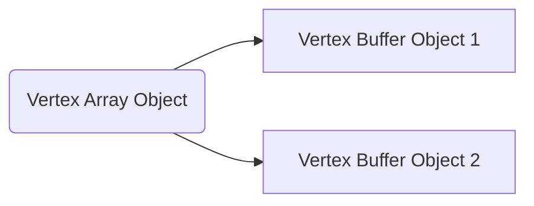

# Triangles and Color


After creating the window, we now move on to creating our first triangle.


#### Input and Color

If everything has compiled thus far, then we should be able to try out input handling and coloring the screen.

Lets create a function to handle our input, in this case checking if `SPACE` has been pressed, and test it by printing "space pressed" to the console.

```cpp
void handleInput(GLFWwindow* window) {  // input related events go in here
    if (glfwGetKey(window, GLFW_KEY_SPACE) == GLFW_PRESS) {  // we can use glfwGetKey to check for events occurred on a specific key
        std::cout << "space pressed\n";
    }
}
```

Now we need to call the function in our render loop. Lets also add two other functions, `glClearColor` and `glClear`, to change the background color to a nice blue. 

```cpp
while (!glfwWindowShouldClose(window)) {
    //  Input
    handleInput(window);

    //  Rendering
    glClearColor(0.1f, 0.3f, 0.6f, 1.0f);  // specifies the color that will cover the screen
    glClear(GL_COLOR_BUFFER_BIT);  // sets the background of the viewport to be that which glClearColor specified

    glfwSwapBuffers(window);
    glfwPollEvents();
}
```


#### Drawing a Triangle

Before we write code that creates a triangle, we need to tell OpenGL how we want to draw it. In other words, we need to write a *shader*. A shader is simply a piece of code that runs on our GPU. We can use shaders to calculate positions, colors, other shapes, etc. The two we will focus on here are the *Vertex* and *Fragment* shaders. Shaders are written in `GLSL`, and we compile them on the fly in our C++ code. As such, it would be beneficial to have a function that reads the contents of a shader file into our project.

Here is a function I wrote to read contents from a file. Be sure to create the directory `<your project>/shaders`, where you can include shader files for this program.

```cpp
// Remember to add includes for <string> and <fstream>
static std::string getShader(const std::string& file) {
    std::ifstream inFile;
    std::string location = "shaders/" + file;
    inFile.open(location);
    std::string shader = "";
    char c;
    while (inFile.get(c)) {
        shader += c;
    }
    inFile.close();
    return shader;
}
```

Lets add two files, `vertex.shader` and `fragment.shader` to the `shaders` folder. 

```glsl
// VERTEX SHADER
#version 330 core
layout (location = 0) in vec3 aPos;

void main()
{
    gl_Position = vec4(aPos.x, aPos.y, aPos.z, 1.0);
}
```

```glsl
// FRAGMENT SHADER
#version 330 core
out vec4 FragColor;

void main()
{
    FragColor = vec4(0.2f, 0.7f, 0.8f, 1.0f);
}
```

Now that we have the shaders, we need a way to compile them. Here is the function for that.

```cpp
static unsigned int compileShader(std::string shaderSource, GLenum type) {
    const char* source = shaderSource.c_str();  // get char * for glShaderSource
    unsigned int shader;
    shader = glCreateShader(type);
    glShaderSource(shader, 1, &source, nullptr);
    glCompileShader(shader);

    // Check for shader compile errors
    int result;
    char infoLog[512];
    glGetShaderiv(shader, GL_COMPILE_STATUS, &result);
    if (!result) {
        glGetShaderInfoLog(shader, 512, NULL, infoLog);
        std::cout << "Error compiling shader: " << infoLog << std::endl;
    }
    return shader;
}
```

Back in the main method, we can create our shaders by calling these functions.

```cpp
unsigned int vertexShader = compileShader(getShader("vertex.shader"), GL_VERTEX_SHADER);
unsigned int fragmentShader = compileShader(getShader("fragment.shader"), GL_FRAGMENT_SHADER);
```

The shaders may be compiled, but they aren't currently active in the OpenGL context. To attach them, we need to create a "program".

```cpp
unsigned int triangleProgram = glCreateProgram();
glAttachShader(triangleProgram, vertexShader);
glAttachShader(triangleProgram, fragmentShader);
glLinkProgram(triangleProgram);
// Optional - deleting the shaders since they have been attached to the program
glDeleteShader(vertexShader);  
glDeleteShader(fragmentShader);
```

This is all the code we need for setting up basic shaders. Now we can focus on creating the vertices for our triangle. OpenGL uses a normalized coordinate system when drawing on a screen. In other words, values from `[-1, 1]` for both X and Y, with `(0, 0)` as the center of the window. To draw a triangle, we need to specify three positions that will join up to form the shape. `(-0.5, -0.5)` will be the bottom-left position, `(0.0, 0,5)` the top, and `(0.5, -0.5)` the bottom-right. 

```cpp
// VERTEX DATA
float vertices[9] = {
    -0.5f, -0.5f, 0.0f,
     0.0f,  0.5f, 0.0f,
     0.5f, -0.5f, 0.0f
};
unsigned int VBO, VAO;
glGenVertexArrays(1, &VAO);
glGenBuffers(1, &VBO);
```

##### Vertex Buffer Objects and Vertex Array Objects

*Source found [here][vbo_vao]*

You may notice that we initialize two buffers: the *Vertex Buffer Object* " (VBO) and the *Vertex Array Object* " (VAO). What is the difference?
You can think of Vertex Buffer Objects as *unstructured arrays* of data stored in GPU memory. From the perspective of the GPU, these arrays store *arbitrary values*, but we can make them meaningful by providing instructions on how the GPU should interpret the data. You can layout your data in multiple arrays, or jam it into a single array. Much like in typical programming, using multiple sets of data is clearer and preferred. 

Vertex Array Objects track pointers to VBOs in GPU memory. Multiple VBOs can be managed under a single VAO.



Bind the buffers.

```cpp
glBindVertexArray(VAO);
glBindBuffer(GL_ARRAY_BUFFER, VBO);
```

Add the vertex data to the buffers.

```cpp
glBufferData(GL_ARRAY_BUFFER, sizeof(vertices), vertices, GL_STATIC_DRAW);
glVertexAttribPointer(0, 3, GL_FLOAT, GL_FALSE, 3 * sizeof(float), (void*)0);
glEnableVertexAttribArray(0);
glBindBuffer(GL_ARRAY_BUFFER, 0);
glBindVertexArray(0);
```

In the render loop, add this code which will render the triangle.

```cpp
glUseProgram(triangleProgram);
glBindVertexArray(VAO);
glDrawArrays(GL_TRIANGLES, 0, 3);
```

##### Source Code

```cpp
#include <glad/glad.h>
#include <GLFW/glfw3.h>
#include <iostream>
#include <string>
#include <fstream>

void framebuffer_size_callback(GLFWwindow* window, int width, int height);

void handleInput(GLFWwindow* window);

static std::string getShader(const std::string& file);

static unsigned int compileShader(std::string shaderSource, GLenum type);


int main() {
    // GLFW WINDOW HINTS
    glfwInit();
    glfwWindowHint(GLFW_CONTEXT_VERSION_MAJOR, 3);
    glfwWindowHint(GLFW_CONTEXT_VERSION_MINOR, 3);
    glfwWindowHint(GLFW_OPENGL_PROFILE, GLFW_OPENGL_CORE_PROFILE);

    // GLFW WINDOW CREATION
    GLFWwindow* window = glfwCreateWindow(800, 600, "The Real", NULL, NULL);
    if (window == NULL) {
        std::cout << "Failed to create GLFW window\n";
        glfwTerminate();
        return -1;
    }
    glfwMakeContextCurrent(window);

    // GLAD INIT
    if (!gladLoadGLLoader((GLADloadproc)glfwGetProcAddress)) {
        std::cout << "Failed to initialize GLAD\n";
        return -1;
    }
    glfwSetFramebufferSizeCallback(window, framebuffer_size_callback);

    // COMPILE AND CREATE SHADERS
    unsigned int vertexShader = compileShader(getShader("vertex.shader"), GL_VERTEX_SHADER);
    unsigned int fragmentShader = compileShader(getShader("fragment.shader"), GL_FRAGMENT_SHADER);
    unsigned int triangleProgram = glCreateProgram();
    glAttachShader(triangleProgram, vertexShader);
    glAttachShader(triangleProgram, fragmentShader);
    glLinkProgram(triangleProgram);
    glUseProgram(triangleProgram);
    // Deleting the shaders since they have been attached to the program and we no longer need them
    glDeleteShader(vertexShader);  
    glDeleteShader(fragmentShader);

    // VERTEX DATA
    float vertices[9] = {
        -0.5f, -0.5f, 0.0f,
         0.0f,  0.5f, 0.0f,
         0.5f, -0.5f, 0.0f
    };
    // Creating Objects to send to GPU
    unsigned int VBO, VAO;
    glGenVertexArrays(1, &VAO);
    glGenBuffers(1, &VBO);
    glBindVertexArray(VAO);
    glBindBuffer(GL_ARRAY_BUFFER, VBO);
    // Allocating data to VBO
    glBufferData(GL_ARRAY_BUFFER, sizeof(vertices), vertices, GL_STATIC_DRAW);
    glVertexAttribPointer(0, 3, GL_FLOAT, GL_FALSE, 3 * sizeof(float), (void*)0);
    glEnableVertexAttribArray(0);
    glBindBuffer(GL_ARRAY_BUFFER, 0);
    glBindVertexArray(0);

    // RENDER LOOP
    while (!glfwWindowShouldClose(window)) {
        //  input
        handleInput(window);

        //  rendering
        glClearColor(0.1f, 0.3f, 0.6f, 1.0f);
        glClear(GL_COLOR_BUFFER_BIT);

        glUseProgram(triangleProgram);
        glBindVertexArray(VAO);
        glDrawArrays(GL_TRIANGLES, 0, 3);

        glfwSwapBuffers(window);
        glfwPollEvents();
    }
    glfwTerminate();
    return 0;
}

void framebuffer_size_callback(GLFWwindow* window, int width, int height) {
    glViewport(0, 0, width, height);
}
void handleInput(GLFWwindow* window) {
    if (glfwGetKey(window, GLFW_KEY_SPACE) == GLFW_PRESS) {
        std::cout << "Space pressed\n";
    }
}
static std::string getShader(const std::string& file) {
    std::ifstream inFile;
    std::string location = "shaders/" + file;
    inFile.open(location);

    std::string shader = "";
    char c;
    while (inFile.get(c)) {
        shader += c;
    }
    inFile.close();
    // std::cout << "shader: " << shader << std::endl;
    return shader;
}
static unsigned int compileShader(std::string shaderSource, GLenum type) {
    const char* source = shaderSource.c_str();  // get char * for glShaderSource
    unsigned int shader;
    shader = glCreateShader(type);
    glShaderSource(shader, 1, &source, nullptr);
    glCompileShader(shader);

    // Check for shader compile errors
    int result;
    char infoLog[512];
    glGetShaderiv(shader, GL_COMPILE_STATUS, &result);
    if (!result) {
        glGetShaderInfoLog(shader, 512, NULL, infoLog);
        std::cout << "Error compiling shader: " << infoLog << std::endl;
    }
    return shader;
}
```


#### Drawing a Square with Element Buffer Objects

Before we dive in to the code, you probably want to understand the concept of an *Element Buffer Object* (EBO). The goal of EBOs is to reduce the amount of *vertex data*. But how does that work?

Consider the vertices I would have to store if I wanted to draw a square, composed of two triangles.

```cpp
// VERTEX DATA
float vertices[] = {
    // 1st Triangle
    -0.5f, -0.5f, 0.0f,  // Bottom-Left
    -0.5f,  0.5f, 0.0f,  // Top-Left 
     0.5f, -0.5f, 0.0f,  // Bottom-Right
    // 2nd Triangle
    -0.5f,  0.5f, 0.0f,  // Top-Left (Duplicate Vertex)
     0.5f,  0.5f, 0.0f,  // Top-Right
     0.5f, -0.5f, 0.0f,  // Bottom-Right (Duplicate Vertex)
};
```

There are *6 vertices* for a shape that, hypothetically, only needs *4 vertices*. Luckily, OpenGL provides us with a type of buffer we can use to index our vertices. For example, we can store *4 vertices*, then specify which of these vertices we want to use when drawing shapes.

```cpp
// VERTEX DATA (After)
float vertices[] = {
   -0.5f, -0.5f, 0.0f,  // [0] bottom-left
   -0.5f,  0.5f, 0.0f,  // [1] top-left
    0.5f, -0.5f, 0.0f,  // [2] bottom-right
    0.5f,  0.5f, 0.0f   // [3] top-right
};
unsigned int indices[]{
    0, 1, 2,  // 1st triangle
    1, 2, 3   // 2nd triangle
};
```

As you can see, our vertices have been reduced to the minimal amount we need.

But of course, we need to add more than just that to the code. When we create the buffers, be sure to add an *Element Buffer Object*.

```cpp
// Creating Objects to send to GPU
unsigned int VBO, VAO, EBO;
glGenVertexArrays(1, &VAO);
glGenBuffers(1, &VBO);
glGenBuffers(1, &EBO);
```

Add the vertices to the VBO and the indices to the EBO.

```cpp
// Binding VAO 
glBindVertexArray(VAO);

// Adding vertices to VBO
glBindBuffer(GL_ARRAY_BUFFER, VBO);
glBufferData(GL_ARRAY_BUFFER, sizeof(vertices), &vertices, GL_STATIC_DRAW);
// Adding indices to EBO
glBindBuffer(GL_ELEMENT_ARRAY_BUFFER, EBO);
glBufferData(GL_ELEMENT_ARRAY_BUFFER, sizeof(indices), &indices, GL_STATIC_DRAW);

// Specifies the location and data format of the bound VBO to use when rendering
glVertexAttribPointer(0, 3, GL_FLOAT, GL_FALSE, 3 * sizeof(float), (void*)0);

// Unbinding
glEnableVertexAttribArray(0);
glBindBuffer(GL_ARRAY_BUFFER, 0);
glBindVertexArray(0);
```

In the render loop...

```cpp
// Rendering
glUseProgram(triangleProgram);
glBindVertexArray(VAO);
glDrawElements(GL_TRIANGLES, 6, GL_UNSIGNED_INT, 0);   // glDrawElements instead of glDrawArrays
glBindVertexArray(0);
```

##### Source Code

*Note that the full code includes extra functions defined above.*

```cpp
int main() {
    // GLFW WINDOW HINTS
    glfwInit();
    glfwWindowHint(GLFW_CONTEXT_VERSION_MAJOR, 3);
    glfwWindowHint(GLFW_CONTEXT_VERSION_MINOR, 3);
    glfwWindowHint(GLFW_OPENGL_PROFILE, GLFW_OPENGL_CORE_PROFILE);

    // GLFW WINDOW CREATION
    GLFWwindow* window = glfwCreateWindow(800, 600, "The Real", NULL, NULL);
    if (window == NULL) {
        std::cout << "Failed to create GLFW window\n";
        glfwTerminate();
        return -1;
    }
    glfwMakeContextCurrent(window);

    // GLAD INIT
    if (!gladLoadGLLoader((GLADloadproc)glfwGetProcAddress)) {
        std::cout << "Failed to initialize GLAD\n";
        return -1;
    }
    glfwSetFramebufferSizeCallback(window, framebuffer_size_callback);


    // COMPILE AND CREATE SHADERS
    unsigned int vertexShader = compileShader(getShader("vertex.shader"), GL_VERTEX_SHADER);
    unsigned int fragmentShader = compileShader(getShader("fragment.shader"), GL_FRAGMENT_SHADER);
    unsigned int triangleProgram = glCreateProgram();
    glAttachShader(triangleProgram, vertexShader);
    glAttachShader(triangleProgram, fragmentShader);
    glLinkProgram(triangleProgram);
    glUseProgram(triangleProgram);
    // Deleting the shaders since they have been attached to the program and we no longer need them
    glDeleteShader(vertexShader);  
    glDeleteShader(fragmentShader);

    // VERTEX DATA
    float vertices[] = {
        -0.5f, -0.5f, 0.0f,  // bottom-left
        -0.5f,  0.5f, 0.0f,  // top-left
         0.5f, -0.5f, 0.0f,  // bottom-right
         0.5f,  0.5f, 0.0f   // top-right
    };
    unsigned int indices[]{
        0, 1, 2,  // 1st triangle
        1, 2, 3   // 2nd triangle
    };

    // Creating Objects to send to GPU
    unsigned int VBO, VAO, EBO;
    glGenVertexArrays(1, &VAO);
    glGenBuffers(1, &VBO);
    glGenBuffers(1, &EBO);

    // Binding VAO 
    glBindVertexArray(VAO);

    // Adding vertices to VBO
    glBindBuffer(GL_ARRAY_BUFFER, VBO);
    glBufferData(GL_ARRAY_BUFFER, sizeof(vertices), &vertices, GL_STATIC_DRAW);
    // Adding indices to EBO
    glBindBuffer(GL_ELEMENT_ARRAY_BUFFER, EBO);
    glBufferData(GL_ELEMENT_ARRAY_BUFFER, sizeof(indices), &indices, GL_STATIC_DRAW);

    // Specifies the location and data format of the bound VBO to use when rendering
    glVertexAttribPointer(0, 3, GL_FLOAT, GL_FALSE, 3 * sizeof(float), (void*)0);

    // Unbinding
    glEnableVertexAttribArray(0);
    glBindBuffer(GL_ARRAY_BUFFER, 0);
    glBindVertexArray(0);

    // RENDER LOOP
    while (!glfwWindowShouldClose(window)) {
        //  input
        handleInput(window);

        //  rendering
        glClearColor(0.1f, 0.3f, 0.6f, 1.0f);
        glClear(GL_COLOR_BUFFER_BIT);

        glUseProgram(triangleProgram);
        glBindVertexArray(VAO);
        glDrawElements(GL_TRIANGLES, 6, GL_UNSIGNED_INT, 0);
        glBindVertexArray(0);

        glfwSwapBuffers(window);
        glfwPollEvents();
    }

    glfwTerminate();
    return 0;
}
```


##### Coding Challenge - Two Colored Triangles

At the end of learnopengl's introduction on [creating a triangle][window_code], there are exercises one can do to test their understanding. I decided to try drawing two triangles with separate colors. This is the first time I tried to code any OpenGL without resources online, only with the base code that I previously used.

The first thing I did was create another shader - the *purple* shader. I made a new fragment shader, but not another vertex, since I could reuse the old one. I did this in GLSL then added the corresponding code in C++ to generate the program.

```glsl
// fragmentPurple.shader
#version 330 core
out vec4 FragColor;
void main() 
{
    FragColor = vec4(0.5f, 0.3f, 0.8f, 1.0f);
}
```

This code provides us with the purple shader program. We can reuse the old blue one, which looks a lot like this, and also defines the vertex shader.

```cpp
// Purple Shader Program
unsigned int fragmentShaderPurple = compileShader(getShader("fragmentPurple.shader"), GL_FRAGMENT_SHADER);
unsigned int purpleProgram = glCreateProgram();
glAttachShader(purpleProgram, vertexShader);
glAttachShader(purpleProgram, fragmentShaderPurple);
glLinkProgram(purpleProgram);
```

After creating the shader, it was time to decide how I wanted to implement my buffers.

I decided to use the old VBO and try reworking the rendering with `glDrawElements`, because the [documentation][glDrawElements] indicated I could mess with the indices instead of creating multiple VBOs. After a bit of fiddling, I was left with this code:

```cpp
// (Render Loop)
// Bind the VAO
glBindVertexArray(VAO);

// Drawing the first triangle
glUseProgram(triangleProgram);  // blue shader
glDrawElements(GL_TRIANGLES, 3, GL_UNSIGNED_INT, 0);

// Drawing the second triangle
glUseProgram(purpleProgram);    // purple shader
glDrawElements(GL_TRIANGLES, 3, GL_UNSIGNED_INT, (const void *) (3 * sizeof(unsigned int)));  // (const void *) (3 * sizeof(unsigned int)) tells OpenGL to skip the first 3 unsigned ints

glBindVertexArray(0);
```

Initially, I had `glDrawElements(GL_TRIANGLES, 3, GL_UNSIGNED_INT, (const void *) 3`, which didn't draw the second triangle. I intended to draw `3` vertices after skipping three vertices. Then I remembered the offset was in bytes, so I added the `* sizeof(unsigned int)`.

##### Source Code

*Note that the full code includes extra functions defined above, and a new shader file.*

```cpp
int main() {
    // GLFW WINDOW HINTS
    glfwInit();
    glfwWindowHint(GLFW_CONTEXT_VERSION_MAJOR, 3);
    glfwWindowHint(GLFW_CONTEXT_VERSION_MINOR, 3);
    glfwWindowHint(GLFW_OPENGL_PROFILE, GLFW_OPENGL_CORE_PROFILE);

    // GLFW WINDOW CREATION
    GLFWwindow* window = glfwCreateWindow(800, 600, "The Real", NULL, NULL);
    if (window == NULL) {
        std::cout << "Failed to create GLFW window\n";
        glfwTerminate();
        return -1;
    }
    glfwMakeContextCurrent(window);

    // GLAD INIT
    if (!gladLoadGLLoader((GLADloadproc)glfwGetProcAddress)) {
        std::cout << "Failed to initialize GLAD\n";
        return -1;
    }
    glfwSetFramebufferSizeCallback(window, framebuffer_size_callback);


    // COMPILE AND CREATE SHADERS
    unsigned int vertexShader = compileShader(getShader("vertex.shader"), GL_VERTEX_SHADER);
    unsigned int fragmentShader = compileShader(getShader("fragment.shader"), GL_FRAGMENT_SHADER);
    unsigned int triangleProgram = glCreateProgram();
    glAttachShader(triangleProgram, vertexShader);
    glAttachShader(triangleProgram, fragmentShader);
    glLinkProgram(triangleProgram);
    glUseProgram(triangleProgram);

    // Purple shader to test understanding
    unsigned int fragmentShaderPurple = compileShader(getShader("fragmentPurple.shader"), GL_FRAGMENT_SHADER);
    unsigned int purpleProgram = glCreateProgram();
    glAttachShader(purpleProgram, vertexShader);
    glAttachShader(purpleProgram, fragmentShaderPurple);
    glLinkProgram(purpleProgram);

    // Deleting the shaders since they have been attached to the program and we no longer need them
    glDeleteShader(vertexShader);  
    glDeleteShader(fragmentShader);
    glDeleteShader(fragmentShaderPurple);

    // VERTEX DATA
    float vertices[] = {
        -0.5f, -0.5f, 0.0f,  // bottom-left
        -0.5f,  0.5f, 0.0f,  // top-left
         0.5f, -0.5f, 0.0f,  // bottom-right
         0.5f,  0.5f, 0.0f   // top-right
    };
    unsigned int indices[]{
        0, 1, 2,  // 1st triangle
        1, 2, 3   // 2nd triangle
    };

    // Creating Objects to send to GPU
    unsigned int VBO, VAO, EBO;
    glGenVertexArrays(1, &VAO);
    glGenBuffers(1, &VBO);
    glGenBuffers(1, &EBO);

    // Binding VAO 
    glBindVertexArray(VAO);

    // Adding vertices to VBO
    glBindBuffer(GL_ARRAY_BUFFER, VBO);
    glBufferData(GL_ARRAY_BUFFER, sizeof(vertices), &vertices, GL_STATIC_DRAW);
    // Adding indices to EBO
    glBindBuffer(GL_ELEMENT_ARRAY_BUFFER, EBO);
    glBufferData(GL_ELEMENT_ARRAY_BUFFER, sizeof(indices), &indices, GL_STATIC_DRAW);

    // Specifies the location and data format of the bound VBO to use when rendering
    glVertexAttribPointer(0, 3, GL_FLOAT, GL_FALSE, 3 * sizeof(float), (void*)0);

    // Unbinding
    glEnableVertexAttribArray(0);
    glBindBuffer(GL_ARRAY_BUFFER, 0);
    glBindVertexArray(0);

    // RENDER LOOP
    while (!glfwWindowShouldClose(window)) {
        // Key Input
        handleInput(window);

        // Rendering
        glClearColor(0.1f, 0.3f, 0.6f, 1.0f);
        glClear(GL_COLOR_BUFFER_BIT);

        // Bind the VAO
        glBindVertexArray(VAO);

        // Drawing the first triangle
        glUseProgram(triangleProgram);
        glDrawElements(GL_TRIANGLES, 3, GL_UNSIGNED_INT, 0);

        // Drawing the second triangle
        glUseProgram(purpleProgram);
        glDrawElements(GL_TRIANGLES, 3, GL_UNSIGNED_INT, (const void *) (3 * sizeof(unsigned int)));  // (const void *) (3 * sizeof(unsigned int)) Tells OpenGL to skip the first 3 unsigned ints

        glBindVertexArray(0);

        glfwSwapBuffers(window);
        glfwPollEvents();
    }
```


