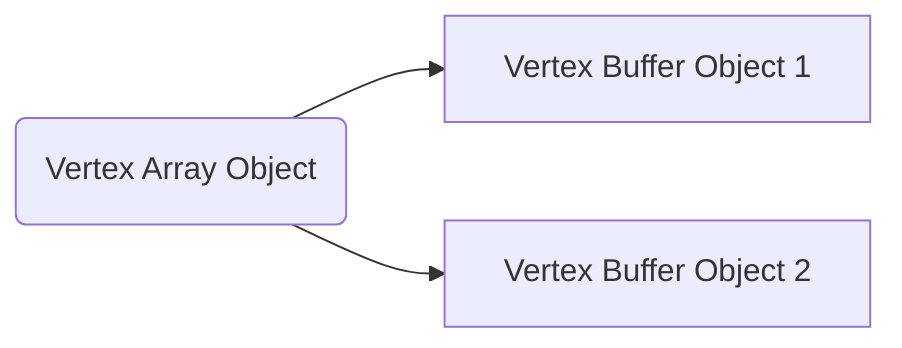

# OpenGL research

*By Gabriel Rosas*

This is a document following my progression learning OpenGL with C++. There are many things I still have yet to learn, but perhaps solutions to some of the problems I had may be of use to someone else. 


## OpenGL Theory

This is a section where I compile useful information I've found on the internet in understanding the abstracts of OpenGL. I am currently using [this][learn] website to learn OpenGL.

OpenGL is an API that provides us with the links to our GPU's graphics functions. A prime misconception is that we install OpenGL. This is wrong: OpenGL functions are implemented by our graphics card manufacturer. What we need to download are APIs that can manage [inputs][], handle [windows][glfw], and perhaps some that make working with cross-platform easier. 

If we already have OpenGL functions, how do we access them? Since there are many different versions of OpenGL drivers, the location of most of its functions is not known at compile-time and needs to be queried at run-time. Though we could find these locations and manually link them, the easier option is to install a library that provides the links for us, for example, [GLEW][]. GLEW finds functions that are supported on our graphics cards and loads them to a C++ header file, which allows us to call them. [This][cherno] video is a great resource to follow if you are interested in installing `GLFW` and `GLEW`.


### Core-Profile and Immediate Mode

| Core-Profile                                                 | Immediate Mode                                               |
| ------------------------------------------------------------ | ------------------------------------------------------------ |
| More flexible<br />More features<br />More control<br />Efficient<br />Modern | "Legacy" Mode<br />Simpler, but hides a lot of advanced functionality<br />Inefficient<br />Deprecated features<br /> |


### State Machine

OpenGL is ultimately a collection of variables that define how it should operate. The state of OpenGL is often referred to as the **context**. For example, if we wanted to switch from drawing triangles to drawing lines, the code might **look** something like: `glSetDrawState(GL_TRIANGLE, context)` (but wouldn't actually be that).


### Objects

Objects in OpenGL are written in C but allow many derivations for other languages. An OpenGL object is a collection of **options** that represent a **subset** of OpenGL's state. 


### Creating a Window

Before creating graphics, we need to create a window to draw in. However, creating windows are specific per operating system. OpenGL tries to abstract itself from creating windows, meaning it is preferred to use an external library. [GLFW][glfw] is a library, written in C, that handles windows across multiple platforms. Whether it be Mac, Linux, or Windows, we can count on GLFW to sort out our windows and handle input so we can work on graphics.


#### Building GLFW

In this section, I attempted to build GLFW without using the precompiled binaries. In other words, I compiled the source code myself. [Here][glfw_build] is the tutorial I followed. Though you can download the binaries pre-compiled, it is good practice to build them yourself.

1. [Download][glfw] the source code. Take note of the location you saved the source code to, since we will need it for CMake.

2. Install [CMake][].
   *CMake is a tool that can generate project/solution files of a user's choice. Then we can compile those files in the solution. Eg. a Visual Studio solution.*
   
   |                             Step                             |                          Reference                           |
   | :----------------------------------------------------------: | :----------------------------------------------------------: |
   | `Run` CMake<br />Add `source`[^1] and `output`[^2] folder locations<br />Click `Configure` |  |
   |   Enter *your* Visual Studio version.<br />Click `Finish`    |  |
   | Here we can decide what files to generate. I recommend leaving the defaults.<br />Click `Generate` |  |
   | Open the Visual Studio Solution that was generated in the root destination folder. |  |
   |                    Click `Build Solution`                    |  |
   |          The library should be built in `src/Debug`          |           |
   
   [^1]: The source should be the root folder of GLFW
   [^2]: The output can be any location


#### Setting up GLFW in Visual Studio

Now that we have `glfw3.lib` compiled, we can set up our first project. There are two main steps we need to complete: 1) Creating a project and 2) linking our dependencies. There are different ways of linking our dependencies, but from what I've noted, and what [learnopengl][learn] recommends, is to create a `dependencies` directory with two sub-directories, `dependencies/includes` for header files and `dependencies/lib` for libraries such as `glfw3.lib`. Then we can reference these locations in Visual Studio settings.

|                             Step                             |                          Reference                           |
| :----------------------------------------------------------: | :----------------------------------------------------------: |
|                `Create` an Empty C++ Project                 |  |
|       Name it anything, locate it anywhere convenient        |  |
| In the root of your newly created project, create a folder called `dependencies`<br />The root directory should have the `<your project>.sln` file |  |
| In this dependencies folder, create subfolders for includes and library files |  |
| In the source GLFW folder, navigate to `include`<br />Copy the folder `GLFW`<br />Paste it into `<your VS project>/dependencies/includes` |  |
| In our compiled GLFW folder, navigate to `src/Debug`<br />Copy `glfw3.lib`<br />Paste it into `<your VS project>/dependencies/lib` |  |
|     Right-click your VS project and select `Properties`      |  |
| In `Configuration Properties/VC++ Directories`, edit `Include Directories` |  |
| Add `$(SolutionDir)dependencies\includes` as an extra directory<br />Click `OK` |  |
| In `Configuration Properties/VC++ Directories`, edit `Library Directories` |  |
| Add `$(SolutionDir)dependencies\lib` as an extra directory<br />Click `OK` |  |
| In `Configuration Properties/Linker/Input`, edit `Additional Dependencies` |  |
| Add `glfw3.lib` (which you compiled) and `opengl32.lib` (that comes with Visual Studio)<br />Click `OK` |  |
| Right-click your VS project and select `Properties/Add/New Item...` |  |
|                      Create a C++ file                       |  |
| Now you should be able to add `include <GLFW/glfw3.h>` without any reference errors |  |

##### GLFW Problems

After completing the steps above, I tried to build the project but received the error `fatal error LNK1104: cannot open file 'opengl32.lib'`. This was due to a linking error, but I did not know where `opengl32.lib` was because I assumed it came with Visual Studio. Turns out, it did. All I needed to do was add `$(VC_IncludePath)` and `$(WindowsSDK_IncludePath)` in `VC++ Directories/Include Directories` as other include directories, and add `$(VC_LibraryPath_x86)` and `$(WindowsSDK_LibraryPath_x86)` in `VC++ Directories/Library Directories` as other library directories. Here is the [source][linkerrorsolution] that helped me solve the problem.


#### Setting up GLAD in Visual Studio

As I mentioned in my *OpenGL theory* intro, OpenGL's functions are already embedded in our system. We just need to point to them in our C++ code. If we were to manually retrieve locations of each function, the code would look something like this:

```cpp
// define the function's prototype
typedef void (*GL_GENBUFFERS) (GLsizei, GLuint*);
// find the function and assign it to a function pointer
GL_GENBUFFERS glGenBuffers  = (GL_GENBUFFERS)wglGetProcAddress("glGenBuffers");
// function can now be called as normal
unsigned int buffer;
glGenBuffers(1, &buffer);
```

*Sample code from [learnopengl][glfw_build]*

If I've learnt anything about programmers, its that we avoid extra effort whenever possible. GLAD is a service provided by some kind souls that have automated this retrieval processes for us. We can request relevant OpenGL function definitions in the GLAD [web interface][], such as version-specific or core functions.

|                             Step                             |                          Reference                           |
| :----------------------------------------------------------: | :----------------------------------------------------------: |
| Go to the GLAD web interface<br />Select `C/C++` for Language<br />Select `OpenGL` for Specification<br />Select a `GL version` above `3.3`<br />Select `Core` for Profile<br />Select `Generate a loader`<br />(Optional) Add the extensions<br />`GENERATE` |  |
|                     Download `glad.zip`                      |  |
|                      Extract the files                       |  |
| In your Visual Studio project, add the contents of `glad/include`  (`glad` and `KHR`) to your includes dependency folder |  |
| Add `glad.c` from `glad/src` to your Visual Studio project files<br />*Note:* You also need to add `glad.c` as a "new item" in Visual Studio |  |

##### GLAD Problems

After running the `Local Windows Debugger`, I got the error `library machine type 'x64' conflicts with target machine type 'x86'`. I compiled and set up the project for `64-bit`, but I accidently ran the debugger in `32-bit` mode. After swapping to `64-bit` mode, I found my include directories unlinked. I had to go back into the project properties and add my `include` and `lib` directories to `VC++ Directories`, then add back the missing `glfw3.lib` and `opengl32.lib` to the linker.

If building the project does not produce any more errors, then we can move on to the next step.


### Programming a Window

*[docs.gl][docs_gl] provides the official documentation for OpenGL functions. For extra information on a GL function, feel free to reference it.*

Add the includes of GLAD and GLFW. GLAD needs to be included before GLFW, otherwise you get the error `fatal error C1189: #error:  OpenGL header already included, remove this include, glad already provides it`.

``````cpp
#include <glad/glad.h>
#include <GLFW/glfw3.h>
#include <iostream>
``````

In the main function, initialize GLFW and provide some information on features of our window.

```cpp
glfwInit();  // must be called before calling most GLFW functions - initializes GLFW.
glfwWindowHint(GLFW_CONTEXT_VERSION_MAJOR, 3);  // sets '3' as the Major version hint for when glfwCreateWindow is called
glfwWindowHint(GLFW_CONTEXT_VERSION_MINOR, 3);  // sets '3' as the Minor version hint for when glfwCreateWindow is called
glfwWindowHint(GLFW_OPENGL_PROFILE, GLFW_OPENGL_CORE_PROFILE);  // explicitly use core-profile functions (glfwWindowHint(GLFW_OPENGL_FORWARD_COMPAT, GL_TRUE) for Mac OS X)
```

Now we can create the window. Note that `glfwCreateWindow` returns a pointer.

```cpp
GLFWwindow* window = glfwCreateWindow(800, 600, "Window name", NULL, NULL);  // create the window
if (window == NULL) {  // if the window is NULL, an error has occurred
    std::cout << "Failed to create GLFW window\n";
    glfwTerminate();  // terminate GLFW upon error
    return -1;
}
glfwMakeContextCurrent(window);  // activate the window (makes the OpenGL or OpenGL ES context of the specified window)
```

GLFW has passed all the checks. Now we do the same for GLAD

```cpp
if (!gladLoadGLLoader((GLADloadproc)glfwGetProcAddress)) {
    std::cout << "Failed to initialize GLAD\n";
    return -1;
}
```

We need to define the dimensions of the window where OpenGL can draw. This is known as the *viewport*. Typically, the viewport covers the whole window. We can call it once at the start, but that will only update the viewport then. The viewport will not change if we were to later resize the window. By creating a function with `glViewport`, we can update the viewport the moment a user resizes the window.

```cpp
void framebuffer_size_callback(GLFWwindow* window, int width, int height) {
    glViewport(0, 0, width, height);  // sets OpenGL's boundaries in the window
}

int main() {
    /* previous code */
    glfwSetFramebufferSizeCallback(window, framebuffer_size_callback);  // calls our viewport function whenever the window is resized
}
```

Now we can create the *render loop*. This loop will allow us to continuously draw images to the screen, rather than drawing the initial frame then exiting. 

```cpp
while (!glfwWindowShouldClose(window)) {  // the render loop
    glfwSwapBuffers(window);  // double buffers fix screen tearing
    glfwPollEvents();  // handles events in the event queue
}
glfwTerminate();  // terminates GLFW after completion
return 0;
```

That is all the starter code for creating a window. All of it can be found on [learningopengl][window_code].

##### Linker Problems

Upon building the project, the linker error occurred: `unresolved external symbol _gladLoadGLLoader`. I was sure I followed the tutorial correctly, but found that adding a file to your Visual Studio project is not as simple as dragging it into the project directory. [This][glad_error] source helped me realize that you need to make `glad.c` a "project item"; in other words *right-clicking* the solution, then *adding* the new item "`glad.c`".


#### Input and Color

If everything has compiled thus far, then we should be able to try out input handling and coloring the screen.

Lets create a function to handle our input, in this case checking if `SPACE` has been pressed, and test it by printing "space pressed" to the console.

```cpp
void handleInput(GLFWwindow* window) {  // input related events go in here
    if (glfwGetKey(window, GLFW_KEY_SPACE) == GLFW_PRESS) {  // we can use glfwGetKey to check for events occurred on a specific key
        std::cout << "space pressed\n";
    }
}
```

Now we need to call the function in our render loop. Lets also add two other functions, `glClearColor` and `glClear`, to change the background color to a nice blue. 

```cpp
while (!glfwWindowShouldClose(window)) {
    //  Input
    handleInput(window);

    //  Rendering
    glClearColor(0.1f, 0.3f, 0.6f, 1.0f);  // specifies the color that will cover the screen
    glClear(GL_COLOR_BUFFER_BIT);  // sets the background of the viewport to be that which glClearColor specified

    glfwSwapBuffers(window);
    glfwPollEvents();
}
```


#### Drawing a Triangle

Before we write code that creates a triangle, we need to tell OpenGL how we want to draw it. In other words, we need to write a *shader*. A shader is simply a piece of code that runs on our GPU. We can use shaders to calculate positions, colors, other shapes, etc. The two we will focus on here are the *Vertex* and *Fragment* shaders. Shaders are written in `GLSL`, and we compile them on the fly in our C++ code. As such, it would be beneficial to have a function that reads the contents of a shader file into our project.

Here is a function I wrote to read contents from a file. Be sure to create the directory `<your project>/shaders`, where you can include shader files for this program.

```cpp
// Remember to add includes for <string> and <fstream>
static std::string getShader(const std::string& file) {
    std::ifstream inFile;
    std::string location = "shaders/" + file;
    inFile.open(location);
    std::string shader = "";
    char c;
    while (inFile.get(c)) {
        shader += c;
    }
    inFile.close();
    return shader;
}
```

Lets add two files, `vertex.shader` and `fragment.shader` to the `shaders` folder. 

```glsl
// VERTEX SHADER
#version 330 core
layout (location = 0) in vec3 aPos;

void main()
{
    gl_Position = vec4(aPos.x, aPos.y, aPos.z, 1.0);
}
```

```glsl
// FRAGMENT SHADER
#version 330 core
out vec4 FragColor;

void main()
{
    FragColor = vec4(0.2f, 0.7f, 0.8f, 1.0f);
}
```

Now that we have the shaders, we need a way to compile them. Here is the function for that.

```cpp
static unsigned int compileShader(std::string shaderSource, GLenum type) {
    const char* source = shaderSource.c_str();  // get char * for glShaderSource
    unsigned int shader;
    shader = glCreateShader(type);
    glShaderSource(shader, 1, &source, nullptr);
    glCompileShader(shader);

    // Check for shader compile errors
    int result;
    char infoLog[512];
    glGetShaderiv(shader, GL_COMPILE_STATUS, &result);
    if (!result) {
        glGetShaderInfoLog(shader, 512, NULL, infoLog);
        std::cout << "Error compiling shader: " << infoLog << std::endl;
    }
    return shader;
}
```

Back in the main method, we can create our shaders by calling these functions.

```cpp
unsigned int vertexShader = compileShader(getShader("vertex.shader"), GL_VERTEX_SHADER);
unsigned int fragmentShader = compileShader(getShader("fragment.shader"), GL_FRAGMENT_SHADER);
```

The shaders may be compiled, but they aren't currently active in the OpenGL context. To attach them, we need to create a "program".

```cpp
unsigned int triangleProgram = glCreateProgram();
glAttachShader(triangleProgram, vertexShader);
glAttachShader(triangleProgram, fragmentShader);
glLinkProgram(triangleProgram);
// Optional - deleting the shaders since they have been attached to the program
glDeleteShader(vertexShader);  
glDeleteShader(fragmentShader);
```

This is all the code we need for setting up basic shaders. Now we can focus on creating the vertices for our triangle. OpenGL uses a normalized coordinate system when drawing on a screen. In other words, values from `[-1, 1]` for both X and Y, with `(0, 0)` as the center of the window. To draw a triangle, we need to specify three positions that will join up to form the shape. `(-0.5, -0.5)` will be the bottom-left position, `(0.0, 0,5)` the top, and `(0.5, -0.5)` the bottom-right. 

```cpp
// VERTEX DATA
float vertices[9] = {
    -0.5f, -0.5f, 0.0f,
     0.0f,  0.5f, 0.0f,
     0.5f, -0.5f, 0.0f
};
unsigned int VBO, VAO;
glGenVertexArrays(1, &VAO);
glGenBuffers(1, &VBO);
```

##### Vertex Buffer Objects and Vertex Array Objects

*Source found [here][vbo_vao]*

You may notice that we initialize two buffers: the *Vertex Buffer Object* " (VBO) and the *Vertex Array Object* " (VAO). What is the difference?
You can think of Vertex Buffer Objects as *unstructured arrays* of data stored in GPU memory. From the perspective of the GPU, these arrays store *arbitrary values*, but we can make them meaningful by providing instructions on how the GPU should interpret the data. You can layout your data in multiple arrays, or jam it into a single array. Much like in typical programming, using multiple sets of data is clearer and preferred. 

Vertex Array Objects track pointers to VBOs in GPU memory. Multiple VBOs can be managed under a single VAO.



Bind the buffers.

```cpp
glBindVertexArray(VAO);
glBindBuffer(GL_ARRAY_BUFFER, VBO);
```

Add the vertex data to the buffers.

```cpp
glBufferData(GL_ARRAY_BUFFER, sizeof(vertices), vertices, GL_STATIC_DRAW);
glVertexAttribPointer(0, 3, GL_FLOAT, GL_FALSE, 3 * sizeof(float), (void*)0);
glEnableVertexAttribArray(0);
glBindBuffer(GL_ARRAY_BUFFER, 0);
glBindVertexArray(0);
```

In the render loop, add this code which will render the triangle.

```cpp
glUseProgram(triangleProgram);
glBindVertexArray(VAO);
glDrawArrays(GL_TRIANGLES, 0, 3);
```

##### Source Code

```cpp
#include <glad/glad.h>
#include <GLFW/glfw3.h>
#include <iostream>
#include <string>
#include <fstream>

void framebuffer_size_callback(GLFWwindow* window, int width, int height);

void handleInput(GLFWwindow* window);

static std::string getShader(const std::string& file);

static unsigned int compileShader(std::string shaderSource, GLenum type);


int main() {
    // GLFW WINDOW HINTS
    glfwInit();
    glfwWindowHint(GLFW_CONTEXT_VERSION_MAJOR, 3);
    glfwWindowHint(GLFW_CONTEXT_VERSION_MINOR, 3);
    glfwWindowHint(GLFW_OPENGL_PROFILE, GLFW_OPENGL_CORE_PROFILE);

    // GLFW WINDOW CREATION
    GLFWwindow* window = glfwCreateWindow(800, 600, "The Real", NULL, NULL);
    if (window == NULL) {
        std::cout << "Failed to create GLFW window\n";
        glfwTerminate();
        return -1;
    }
    glfwMakeContextCurrent(window);

    // GLAD INIT
    if (!gladLoadGLLoader((GLADloadproc)glfwGetProcAddress)) {
        std::cout << "Failed to initialize GLAD\n";
        return -1;
    }
    glfwSetFramebufferSizeCallback(window, framebuffer_size_callback);

    // COMPILE AND CREATE SHADERS
    unsigned int vertexShader = compileShader(getShader("vertex.shader"), GL_VERTEX_SHADER);
    unsigned int fragmentShader = compileShader(getShader("fragment.shader"), GL_FRAGMENT_SHADER);
    unsigned int triangleProgram = glCreateProgram();
    glAttachShader(triangleProgram, vertexShader);
    glAttachShader(triangleProgram, fragmentShader);
    glLinkProgram(triangleProgram);
    glUseProgram(triangleProgram);
    // Deleting the shaders since they have been attached to the program and we no longer need them
    glDeleteShader(vertexShader);  
    glDeleteShader(fragmentShader);

    // VERTEX DATA
    float vertices[9] = {
        -0.5f, -0.5f, 0.0f,
         0.0f,  0.5f, 0.0f,
         0.5f, -0.5f, 0.0f
    };
    // Creating Objects to send to GPU
    unsigned int VBO, VAO;
    glGenVertexArrays(1, &VAO);
    glGenBuffers(1, &VBO);
    glBindVertexArray(VAO);
    glBindBuffer(GL_ARRAY_BUFFER, VBO);
    // Allocating data to VBO
    glBufferData(GL_ARRAY_BUFFER, sizeof(vertices), vertices, GL_STATIC_DRAW);
    glVertexAttribPointer(0, 3, GL_FLOAT, GL_FALSE, 3 * sizeof(float), (void*)0);
    glEnableVertexAttribArray(0);
    glBindBuffer(GL_ARRAY_BUFFER, 0);
    glBindVertexArray(0);

    // RENDER LOOP
    while (!glfwWindowShouldClose(window)) {
        //  input
        handleInput(window);

        //  rendering
        glClearColor(0.1f, 0.3f, 0.6f, 1.0f);
        glClear(GL_COLOR_BUFFER_BIT);

        glUseProgram(triangleProgram);
        glBindVertexArray(VAO);
        glDrawArrays(GL_TRIANGLES, 0, 3);

        glfwSwapBuffers(window);
        glfwPollEvents();
    }
    glfwTerminate();
    return 0;
}

void framebuffer_size_callback(GLFWwindow* window, int width, int height) {
    glViewport(0, 0, width, height);
}
void handleInput(GLFWwindow* window) {
    if (glfwGetKey(window, GLFW_KEY_SPACE) == GLFW_PRESS) {
        std::cout << "Space pressed\n";
    }
}
static std::string getShader(const std::string& file) {
    std::ifstream inFile;
    std::string location = "shaders/" + file;
    inFile.open(location);

    std::string shader = "";
    char c;
    while (inFile.get(c)) {
        shader += c;
    }
    inFile.close();
    // std::cout << "shader: " << shader << std::endl;
    return shader;
}
static unsigned int compileShader(std::string shaderSource, GLenum type) {
    const char* source = shaderSource.c_str();  // get char * for glShaderSource
    unsigned int shader;
    shader = glCreateShader(type);
    glShaderSource(shader, 1, &source, nullptr);
    glCompileShader(shader);

    // Check for shader compile errors
    int result;
    char infoLog[512];
    glGetShaderiv(shader, GL_COMPILE_STATUS, &result);
    if (!result) {
        glGetShaderInfoLog(shader, 512, NULL, infoLog);
        std::cout << "Error compiling shader: " << infoLog << std::endl;
    }
    return shader;
}
```


#### Drawing a Square with Element Buffer Objects

Before we dive in to the code, you probably want to understand the concept of an *Element Buffer Object* (EBO). The goal of EBOs is to reduce the amount of *vertex data*. But how does that work?

Consider the vertices I would have to store if I wanted to draw a square, composed of two triangles.

```cpp
// VERTEX DATA
float vertices[] = {
    // 1st Triangle
    -0.5f, -0.5f, 0.0f,  // Bottom-Left
    -0.5f,  0.5f, 0.0f,  // Top-Left 
     0.5f, -0.5f, 0.0f,  // Bottom-Right
    // 2nd Triangle
    -0.5f,  0.5f, 0.0f,  // Top-Left (Duplicate Vertex)
     0.5f,  0.5f, 0.0f,  // Top-Right
     0.5f, -0.5f, 0.0f,  // Bottom-Right (Duplicate Vertex)
};
```

There are *6 vertices* for a shape that, hypothetically, only needs *4 vertices*. Luckily, OpenGL provides us with a type of buffer we can use to index our vertices. For example, we can store *4 vertices*, then specify which of these vertices we want to use when drawing shapes.

```cpp
// VERTEX DATA (After)
float vertices[] = {
   -0.5f, -0.5f, 0.0f,  // [0] bottom-left
   -0.5f,  0.5f, 0.0f,  // [1] top-left
    0.5f, -0.5f, 0.0f,  // [2] bottom-right
    0.5f,  0.5f, 0.0f   // [3] top-right
};
unsigned int indices[]{
    0, 1, 2,  // 1st triangle
    1, 2, 3   // 2nd triangle
};
```

As you can see, our vertices have been reduced to the minimal amount we need.

But of course, we need to add more than just that to the code. When we create the buffers, be sure to add an *Element Buffer Object*.

```cpp
// Creating Objects to send to GPU
unsigned int VBO, VAO, EBO;
glGenVertexArrays(1, &VAO);
glGenBuffers(1, &VBO);
glGenBuffers(1, &EBO);
```

Add the vertices to the VBO and the indices to the EBO.

```cpp
// Binding VAO 
glBindVertexArray(VAO);

// Adding vertices to VBO
glBindBuffer(GL_ARRAY_BUFFER, VBO);
glBufferData(GL_ARRAY_BUFFER, sizeof(vertices), &vertices, GL_STATIC_DRAW);
// Adding indices to EBO
glBindBuffer(GL_ELEMENT_ARRAY_BUFFER, EBO);
glBufferData(GL_ELEMENT_ARRAY_BUFFER, sizeof(indices), &indices, GL_STATIC_DRAW);

// Specifies the location and data format of the bound VBO to use when rendering
glVertexAttribPointer(0, 3, GL_FLOAT, GL_FALSE, 3 * sizeof(float), (void*)0);

// Unbinding
glEnableVertexAttribArray(0);
glBindBuffer(GL_ARRAY_BUFFER, 0);
glBindVertexArray(0);
```

In the render loop...

```cpp
// Rendering
glUseProgram(triangleProgram);
glBindVertexArray(VAO);
glDrawElements(GL_TRIANGLES, 6, GL_UNSIGNED_INT, 0);   // glDrawElements instead of glDrawArrays
glBindVertexArray(0);
```

##### Source Code

*Note that the full code includes extra functions defined above.*

```cpp
int main() {
    // GLFW WINDOW HINTS
    glfwInit();
    glfwWindowHint(GLFW_CONTEXT_VERSION_MAJOR, 3);
    glfwWindowHint(GLFW_CONTEXT_VERSION_MINOR, 3);
    glfwWindowHint(GLFW_OPENGL_PROFILE, GLFW_OPENGL_CORE_PROFILE);

    // GLFW WINDOW CREATION
    GLFWwindow* window = glfwCreateWindow(800, 600, "The Real", NULL, NULL);
    if (window == NULL) {
        std::cout << "Failed to create GLFW window\n";
        glfwTerminate();
        return -1;
    }
    glfwMakeContextCurrent(window);

    // GLAD INIT
    if (!gladLoadGLLoader((GLADloadproc)glfwGetProcAddress)) {
        std::cout << "Failed to initialize GLAD\n";
        return -1;
    }
    glfwSetFramebufferSizeCallback(window, framebuffer_size_callback);


    // COMPILE AND CREATE SHADERS
    unsigned int vertexShader = compileShader(getShader("vertex.shader"), GL_VERTEX_SHADER);
    unsigned int fragmentShader = compileShader(getShader("fragment.shader"), GL_FRAGMENT_SHADER);
    unsigned int triangleProgram = glCreateProgram();
    glAttachShader(triangleProgram, vertexShader);
    glAttachShader(triangleProgram, fragmentShader);
    glLinkProgram(triangleProgram);
    glUseProgram(triangleProgram);
    // Deleting the shaders since they have been attached to the program and we no longer need them
    glDeleteShader(vertexShader);  
    glDeleteShader(fragmentShader);

    // VERTEX DATA
    float vertices[] = {
        -0.5f, -0.5f, 0.0f,  // bottom-left
        -0.5f,  0.5f, 0.0f,  // top-left
         0.5f, -0.5f, 0.0f,  // bottom-right
         0.5f,  0.5f, 0.0f   // top-right
    };
    unsigned int indices[]{
        0, 1, 2,  // 1st triangle
        1, 2, 3   // 2nd triangle
    };

    // Creating Objects to send to GPU
    unsigned int VBO, VAO, EBO;
    glGenVertexArrays(1, &VAO);
    glGenBuffers(1, &VBO);
    glGenBuffers(1, &EBO);

    // Binding VAO 
    glBindVertexArray(VAO);

    // Adding vertices to VBO
    glBindBuffer(GL_ARRAY_BUFFER, VBO);
    glBufferData(GL_ARRAY_BUFFER, sizeof(vertices), &vertices, GL_STATIC_DRAW);
    // Adding indices to EBO
    glBindBuffer(GL_ELEMENT_ARRAY_BUFFER, EBO);
    glBufferData(GL_ELEMENT_ARRAY_BUFFER, sizeof(indices), &indices, GL_STATIC_DRAW);

    // Specifies the location and data format of the bound VBO to use when rendering
    glVertexAttribPointer(0, 3, GL_FLOAT, GL_FALSE, 3 * sizeof(float), (void*)0);

    // Unbinding
    glEnableVertexAttribArray(0);
    glBindBuffer(GL_ARRAY_BUFFER, 0);
    glBindVertexArray(0);

    // RENDER LOOP
    while (!glfwWindowShouldClose(window)) {
        //  input
        handleInput(window);

        //  rendering
        glClearColor(0.1f, 0.3f, 0.6f, 1.0f);
        glClear(GL_COLOR_BUFFER_BIT);

        glUseProgram(triangleProgram);
        glBindVertexArray(VAO);
        glDrawElements(GL_TRIANGLES, 6, GL_UNSIGNED_INT, 0);
        glBindVertexArray(0);

        glfwSwapBuffers(window);
        glfwPollEvents();
    }

    glfwTerminate();
    return 0;
}
```


##### Coding Challenge - Two Colored Triangles

At the end of learnopengl's introduction on [creating a triangle][window_code], there are exercises one can do to test their understanding. I decided to try drawing two triangles with separate colors. This is the first time I tried to code any OpenGL without resources online, only with the base code that I previously used.

The first thing I did was create another shader - the *purple* shader. I made a new fragment shader, but not another vertex, since I could reuse the old one. I did this in GLSL then added the corresponding code in C++ to generate the program.

```glsl
// fragmentPurple.shader
#version 330 core
out vec4 FragColor;
void main() 
{
    FragColor = vec4(0.5f, 0.3f, 0.8f, 1.0f);
}
```

This code provides us with the purple shader program. We can reuse the old blue one, which looks a lot like this, and also defines the vertex shader.

```cpp
// Purple Shader Program
unsigned int fragmentShaderPurple = compileShader(getShader("fragmentPurple.shader"), GL_FRAGMENT_SHADER);
unsigned int purpleProgram = glCreateProgram();
glAttachShader(purpleProgram, vertexShader);
glAttachShader(purpleProgram, fragmentShaderPurple);
glLinkProgram(purpleProgram);
```

After creating the shader, it was time to decide how I wanted to implement my buffers.

I decided to use the old VBO and try reworking the rendering with `glDrawElements`, because the [documentation][glDrawElements] indicated I could mess with the indices instead of creating multiple VBOs. After a bit of fiddling, I was left with this code:

```cpp
// (Render Loop)
// Bind the VAO
glBindVertexArray(VAO);

// Drawing the first triangle
glUseProgram(triangleProgram);  // blue shader
glDrawElements(GL_TRIANGLES, 3, GL_UNSIGNED_INT, 0);

// Drawing the second triangle
glUseProgram(purpleProgram);    // purple shader
glDrawElements(GL_TRIANGLES, 3, GL_UNSIGNED_INT, (const void *) (3 * sizeof(unsigned int)));  // (const void *) (3 * sizeof(unsigned int)) tells OpenGL to skip the first 3 unsigned ints

glBindVertexArray(0);
```

Initially, I had `glDrawElements(GL_TRIANGLES, 3, GL_UNSIGNED_INT, (const void *) 3`, which didn't draw the second triangle. I intended to draw `3` vertices after skipping three vertices. Then I remembered the offset was in bytes, so I added the `* sizeof(unsigned int)`.

##### Source Code

*Note that the full code includes extra functions defined above, and a new shader file.*

```cpp
int main() {
    // GLFW WINDOW HINTS
    glfwInit();
    glfwWindowHint(GLFW_CONTEXT_VERSION_MAJOR, 3);
    glfwWindowHint(GLFW_CONTEXT_VERSION_MINOR, 3);
    glfwWindowHint(GLFW_OPENGL_PROFILE, GLFW_OPENGL_CORE_PROFILE);

    // GLFW WINDOW CREATION
    GLFWwindow* window = glfwCreateWindow(800, 600, "The Real", NULL, NULL);
    if (window == NULL) {
        std::cout << "Failed to create GLFW window\n";
        glfwTerminate();
        return -1;
    }
    glfwMakeContextCurrent(window);

    // GLAD INIT
    if (!gladLoadGLLoader((GLADloadproc)glfwGetProcAddress)) {
        std::cout << "Failed to initialize GLAD\n";
        return -1;
    }
    glfwSetFramebufferSizeCallback(window, framebuffer_size_callback);


    // COMPILE AND CREATE SHADERS
    unsigned int vertexShader = compileShader(getShader("vertex.shader"), GL_VERTEX_SHADER);
    unsigned int fragmentShader = compileShader(getShader("fragment.shader"), GL_FRAGMENT_SHADER);
    unsigned int triangleProgram = glCreateProgram();
    glAttachShader(triangleProgram, vertexShader);
    glAttachShader(triangleProgram, fragmentShader);
    glLinkProgram(triangleProgram);
    glUseProgram(triangleProgram);

    // Purple shader to test understanding
    unsigned int fragmentShaderPurple = compileShader(getShader("fragmentPurple.shader"), GL_FRAGMENT_SHADER);
    unsigned int purpleProgram = glCreateProgram();
    glAttachShader(purpleProgram, vertexShader);
    glAttachShader(purpleProgram, fragmentShaderPurple);
    glLinkProgram(purpleProgram);

    // Deleting the shaders since they have been attached to the program and we no longer need them
    glDeleteShader(vertexShader);  
    glDeleteShader(fragmentShader);
    glDeleteShader(fragmentShaderPurple);

    // VERTEX DATA
    float vertices[] = {
        -0.5f, -0.5f, 0.0f,  // bottom-left
        -0.5f,  0.5f, 0.0f,  // top-left
         0.5f, -0.5f, 0.0f,  // bottom-right
         0.5f,  0.5f, 0.0f   // top-right
    };
    unsigned int indices[]{
        0, 1, 2,  // 1st triangle
        1, 2, 3   // 2nd triangle
    };

    // Creating Objects to send to GPU
    unsigned int VBO, VAO, EBO;
    glGenVertexArrays(1, &VAO);
    glGenBuffers(1, &VBO);
    glGenBuffers(1, &EBO);

    // Binding VAO 
    glBindVertexArray(VAO);

    // Adding vertices to VBO
    glBindBuffer(GL_ARRAY_BUFFER, VBO);
    glBufferData(GL_ARRAY_BUFFER, sizeof(vertices), &vertices, GL_STATIC_DRAW);
    // Adding indices to EBO
    glBindBuffer(GL_ELEMENT_ARRAY_BUFFER, EBO);
    glBufferData(GL_ELEMENT_ARRAY_BUFFER, sizeof(indices), &indices, GL_STATIC_DRAW);

    // Specifies the location and data format of the bound VBO to use when rendering
    glVertexAttribPointer(0, 3, GL_FLOAT, GL_FALSE, 3 * sizeof(float), (void*)0);

    // Unbinding
    glEnableVertexAttribArray(0);
    glBindBuffer(GL_ARRAY_BUFFER, 0);
    glBindVertexArray(0);

    // RENDER LOOP
    while (!glfwWindowShouldClose(window)) {
        // Key Input
        handleInput(window);

        // Rendering
        glClearColor(0.1f, 0.3f, 0.6f, 1.0f);
        glClear(GL_COLOR_BUFFER_BIT);

        // Bind the VAO
        glBindVertexArray(VAO);

        // Drawing the first triangle
        glUseProgram(triangleProgram);
        glDrawElements(GL_TRIANGLES, 3, GL_UNSIGNED_INT, 0);

        // Drawing the second triangle
        glUseProgram(purpleProgram);
        glDrawElements(GL_TRIANGLES, 3, GL_UNSIGNED_INT, (const void *) (3 * sizeof(unsigned int)));  // (const void *) (3 * sizeof(unsigned int)) Tells OpenGL to skip the first 3 unsigned ints

        glBindVertexArray(0);

        glfwSwapBuffers(window);
        glfwPollEvents();
    }
```


### Shaders

As I briefly covered earlier, shaders are programs run on the GPU. In this section, I hope to go into more detail on them and the features they provide.


#### Uniforms

While vertex buffers appear to be used when transferring large amounts of data to GPU memory, uniforms are preferred when transferring small amounts of data from CPU to GPU. Unlike vertex attribute data, uniforms are *global* per shader program.

To create a uniform, we generate a location in a shader program using `glGetUniformLocation`, providing the *shader program* and the *variable name*. Then, we bind data using some function beginning with `glUnform*`. For example:

```cpp
float color[] = { 0.1f, 0.2f, 1.0f };  // Blue
int blueColorLocation = glGetUniformLocation(shaderProgram, "blueColor");  // generate the uniform location
glUniform3f(blueColorLocation, color[0], color[1], color[2]);  // assign a vec3 (float) to blueColor
```

In the GLSL file, we can access the uniform like such:

```glsl
// Fragment Shader
#version 330 core
out vec4 FragColor;
  
uniform vec4 blueColor;  // same variable used in glGetUniformLocation

void main()
{
    FragColor = blueColor;
}   
```


##### Coding Challenge - Glowing Rainbow Shader

About halfway through the [learnopengl shader][learngl_shader] section, I was inspired by the rainbow triangle shader with its unique RGB values that practically exploded from each vertex. I wanted to combine two of the examples - the rainbow shader and the "pulsing" shader, using uniforms to oscillate between different colors. I also wanted to create it with an EBO.

First, I defined the vertex data and indices.

```cpp
// VERTEX DATA
float vertices[] = {
    // positions         // colors
    0.5f, -0.5f, 0.0f,  1.0f, 0.0f, 0.0f,   // bottom right
    -0.5f, -0.5f, 0.0f,  0.0f, 1.0f, 0.0f,   // bottom left
    0.5f,  0.5f, 0.0f,  0.0f, 0.0f, 1.0f,   // top right
    -0.5f,  0.5f, 0.0f,  1.0f, 0.0f, 0.0f    // top left

};
unsigned int indices[]{
    0, 1, 2,  // 1st triangle
    1, 2, 3,  // 2nd triangle
};
```

Then, I bound the the vertices and created an EBO.

```cpp
// Creating Objects to send to GPU
unsigned int VBO, VAO, EBO;
glGenVertexArrays(1, &VAO);
glGenBuffers(1, &VBO);
glGenBuffers(1, &EBO);

// Binding VAO 
glBindVertexArray(VAO);

// Adding vertices to VBO
glBindBuffer(GL_ARRAY_BUFFER, VBO);
glBufferData(GL_ARRAY_BUFFER, sizeof(vertices), &vertices, GL_STATIC_DRAW);

// Linking EBO to VBO
glBindBuffer(GL_ELEMENT_ARRAY_BUFFER, EBO);
glBufferData(GL_ELEMENT_ARRAY_BUFFER, sizeof(indices), indices, GL_STATIC_DRAW);

// Specifies the location and data format of the bound VBO to use when rendering
glVertexAttribPointer(0, 3, GL_FLOAT, GL_FALSE, 6 * sizeof(float), (void*)0);
glEnableVertexAttribArray(0);

glVertexAttribPointer(1, 3, GL_FLOAT, GL_FALSE, 6 * sizeof(float), (void*) (3 * sizeof(float)));
glEnableVertexAttribArray(1);

// Unbinding
glBindBuffer(GL_ARRAY_BUFFER, 0);
glBindVertexArray(0);
```

I generated the uniform in the render loop, updating it based on GLFW time.

```cpp
// Bind the VAO
glBindVertexArray(VAO);

// Update time uniform
float timeValue = glfwGetTime();
int vertexColorLocation = glGetUniformLocation(triangleProgram, "timeValue");
glUseProgram(triangleProgram);
glUniform1f(vertexColorLocation, timeValue);

// Draw triangle
glDrawElements(GL_TRIANGLES, 6, GL_UNSIGNED_INT, 0);

glBindVertexArray(0);
```

Finally, the shader code.

```glsl
// Vertex shader
#version 330 core
layout (location = 0) in vec3 aPos;
layout (location = 1) in vec3 aColor;

out vec3 color;

void main()
{
    gl_Position = vec4(aPos, 1.0);
    color = aColor;
}
```

```glsl
// Fragment shader
#version 330 core
out vec4 FragColor;

uniform float timeValue;
in vec3 color;

void main()
{
    float x = (sin(timeValue + color.x) / 2.0f) + 0.5f;
    float y = (sin(timeValue + color.y) / 2.0f) + 0.5f;
    float z = (sin(timeValue + color.z) / 2.0f) + 0.5f;
    FragColor = vec4(x, y, z, 1.0f);
}
```

##### Source Code

```cpp
int main() {
    
    /* GLFW and GLAD initialization */

    // COMPILE AND CREATE SHADERS
    unsigned int vertexShader = compileShader(getShader("vertex.shader"), GL_VERTEX_SHADER);
    unsigned int fragmentShader = compileShader(getShader("fragment.shader"), GL_FRAGMENT_SHADER);
    unsigned int triangleProgram = glCreateProgram();
    glAttachShader(triangleProgram, vertexShader);
    glAttachShader(triangleProgram, fragmentShader);
    glLinkProgram(triangleProgram);
    glUseProgram(triangleProgram);

    // Deleting the shaders since they have been attached to the program and we no longer need them
    glDeleteShader(vertexShader);  
    glDeleteShader(fragmentShader);

    // VERTEX DATA
    float vertices[] = {
        // positions         // colors
         0.5f, -0.5f, 0.0f,  1.0f, 0.0f, 0.0f,   // bottom right
        -0.5f, -0.5f, 0.0f,  0.0f, 1.0f, 0.0f,   // bottom left
         0.5f,  0.5f, 0.0f,  0.0f, 0.0f, 1.0f,   // top right
        -0.5f,  0.5f, 0.0f,  1.0f, 0.0f, 0.0f    // top left

    };
    unsigned int indices[]{
        0, 1, 2,  // 1st triangle
        1, 2, 3,  // 2nd triangle
    };

    // Creating Objects to send to GPU
    unsigned int VBO, VAO, EBO;
    glGenVertexArrays(1, &VAO);
    glGenBuffers(1, &VBO);
    glGenBuffers(1, &EBO);

    // Binding VAO 
    glBindVertexArray(VAO);

    // Adding vertices to VBO
    glBindBuffer(GL_ARRAY_BUFFER, VBO);
    glBufferData(GL_ARRAY_BUFFER, sizeof(vertices), &vertices, GL_STATIC_DRAW);

    glBindBuffer(GL_ELEMENT_ARRAY_BUFFER, EBO);
    glBufferData(GL_ELEMENT_ARRAY_BUFFER, sizeof(indices), indices, GL_STATIC_DRAW);

    // Specifies the location and data format of the bound VBO to use when rendering
    glVertexAttribPointer(0, 3, GL_FLOAT, GL_FALSE, 6 * sizeof(float), (void*)0);
    glEnableVertexAttribArray(0);

    glVertexAttribPointer(1, 3, GL_FLOAT, GL_FALSE, 6 * sizeof(float), (void*) (3 * sizeof(float)));
    glEnableVertexAttribArray(1);
    
    // Unbinding
    glBindBuffer(GL_ARRAY_BUFFER, 0);
    glBindVertexArray(0);

    // RENDER LOOP
    while (!glfwWindowShouldClose(window)) {
        // Key Input
        handleInput(window);

        // Rendering
        glClearColor(0.1f, 0.3f, 0.6f, 1.0f);
        glClear(GL_COLOR_BUFFER_BIT);

        // Bind the VAO
        glBindVertexArray(VAO);

        // Update time uniform
        float timeValue = glfwGetTime();
        int vertexColorLocation = glGetUniformLocation(triangleProgram, "timeValue");
        glUseProgram(triangleProgram);
        glUniform1f(vertexColorLocation, timeValue);

        // Draw triangle
        glDrawElements(GL_TRIANGLES, 6, GL_UNSIGNED_INT, 0);

        glBindVertexArray(0);

        glfwSwapBuffers(window);
        glfwPollEvents();
    }

    glfwTerminate();
    return 0;
}
```


#### Shader Class

Since I intend to document my learning of OpenGL in this project, I will not go over how to code the shader class, since it is composed of features that I previously explored, only streamlined into a C++ class. I transitioned to the shader class provided by [learnopengl][learngl_shader]. GLM, a library with OpenGL related mathematical functions, can be found [here][glm], as it is used in learnopengl's shader class.

The shader class handles all shader compilation and errors. It also provides functions for uniform creation.

```cpp
// Creating a shader program is reduced to this simple code
Shader program = Shader("shaders/vertex.shader", "shaders/fragment.shader");

// Enabling the program
program.use();

// Example uniform creation (program.set*())
program.setFloat("uniformName", 0.5f);
```


### Textures

If you're familiar with videogames, you will know that images are drawn to the screen. While they can be drawn mathematically, it is much easier to use a digital image, such as a *png* or *jpg*. Textures are mapped to triangles in OpenGL, and to do this, we need to add another attribute to our vertices: *texture coordinates*.

Here are some vertex positions that ultimately create a rectangle on the screen.

```cpp
float vertices[] = {
    // Positions
    0.5f,  0.5f, 0.0f,  // Top Right
    0.5f, -0.5f, 0.0f,  // Bottom Right
   -0.5f, -0.5f, 0.0f,  // Bottom Left
   -0.5f,  0.5f, 0.0f,  // Top Left 
};
unsigned int indices[]{
    0, 1, 2,  // 1st Triangle
    0, 2, 3,  // 2nd Triangle
};
```

Images are mapped by values from `[0.0f, 1.0f]` in both the x and y directions. Lets try and map the *Top Right* vertex to the *Top Right* of an image.

```cpp
float vertices[] = {
    // Positions       // Textures
    0.5f, 0.5f, 0.0f,  1.0f, 1.0f,   // Top Right
    
    /* Excluded Vertices */
};
```

And then the rest.

```cpp
float vertices[] = {
    // Positions        // Textures
    0.5f,  0.5f, 0.0f,  1.0f, 1.0f,   // Top Right
    0.5f, -0.5f, 0.0f,  1.0f, 0.0f,   // Bottom Right
   -0.5f, -0.5f, 0.0f,  0.0f, 0.0f,   // Bottom Left
   -0.5f,  0.5f, 0.0f,  0.0f, 1.0f    // Top Left 
};

unsigned int indices[]{
    0, 1, 2,  // 1st Triangle
    0, 2, 3,  // 2nd Triangle
};
```

Hopefully, though brief, this explanation makes sense. Now we roughly understand texture coordinates, but how do we actually add images?

#### Loading Images

`stb_image.h` is a popular library by Sean Barrett that deals with common file formats. Like other libraries we need to download and add them to our project files.

1. Download [stb_image.h][STB_DOWNLOAD]

2. |                             Step                             |                          Reference                           |
   | :----------------------------------------------------------: | :----------------------------------------------------------: |
   |        Extract `stb-master` and locate `stb_image.h`         |  |
   | Copy `stb_image.h` and add it to your project's includes folder<br />I like to have it in an `stb` folder, like so `..includes/stb/stb_image.h` |  |

3. Add the include of the header file. **NOTE**- you need to define `STB_IMAGE_IMPLEMENTATION` before including `stb_image.h`
   ```cpp
   #define STB_IMAGE_IMPLEMENTATION
   #include <stb/stb_image.h>
   ```


Now that we have functions to load images, we can add them to our project.

```cpp
// Getting Texture
stbi_set_flip_vertically_on_load(true);
// Generating a texture like we would a buffer
unsigned int texture;
glGenTextures(1, &texture);
glBindTexture(GL_TEXTURE_2D, texture);

// Setting the texture wrapping/filtering options (on the currently bound texture object)
glTexParameteri(GL_TEXTURE_2D, GL_TEXTURE_WRAP_S, GL_REPEAT);
glTexParameteri(GL_TEXTURE_2D, GL_TEXTURE_WRAP_T, GL_REPEAT);
glTexParameteri(GL_TEXTURE_2D, GL_TEXTURE_MIN_FILTER, GL_LINEAR_MIPMAP_LINEAR);
glTexParameteri(GL_TEXTURE_2D, GL_TEXTURE_MAG_FILTER, GL_LINEAR);

// Loading and generating the texture
int width, height, nrChannels;
unsigned char* data = stbi_load("image.jpg", &width, &height, &nrChannels, 0);
if (data)
{
    glTexImage2D(GL_TEXTURE_2D, 0, GL_RGB, width, height, 0, GL_RGB, GL_UNSIGNED_BYTE, data);
    glGenerateMipmap(GL_TEXTURE_2D);
}
else
{
    std::cout << "Failed to load texture" << std::endl;
}
stbi_image_free(data);
```

In our shaders...

```glsl
// Vertex Shader
#version 330 core
layout (location = 0) in vec3 aPos;
layout (location = 1) in vec2 aTexCoord;

out vec2 TexCoord;

void main()
{
    gl_Position = vec4(aPos, 1.0);
    TexCoord = vec2(aTexCoord.x, aTexCoord.y);
}
```

```glsl
// Fragment Shader
#version 330 core
    
out vec4 FragColor;
in vec2 TexCoord;

// texture samplers
uniform sampler2D texture1;

void main()
{
    FragColor = texture(texture1, TexCoord);
}
```

In the render loop...

```cpp
while (!glfwWindowShouldClose(window)) {
        
    /* Key Input and Clearing */

    // bind textures on corresponding texture units
    glActiveTexture(GL_TEXTURE0);
    glBindTexture(GL_TEXTURE_2D, texture);
    
    /* Drawing Triangles */
}
```


### Transformations and Coordinates

Before we get into transformations, we want to install another helper-library. [GLM][GLM_WEB] (Open**GL** **M**athematics) is commonly used for matrix mathematics which is how we can move, rotate, and scale our elements. 

#### Adding GLM

1. Download the GLM files [here][GLM_DOWNLOAD] (or navigate through the GLM website until you find the source code).

2. |                          Step                          |                          Reference                           |
   | :----------------------------------------------------: | :----------------------------------------------------------: |
   |             Extract the zip and find `glm`             |  |
   | Copy the `glm` root folder into your projects includes |  |

3. Add these includes - they are the primary header files.
   ```cpp
   #include <glm/glm.hpp>
   #include <glm/gtc/matrix_transform.hpp>
   #include <glm/gtc/type_ptr.hpp>
   ```


#### First Transformations

Ideally, you'd want to understand matrix math. I lack knowledge on matrix math, so this section is mainly for messing around with values. That being said, there are three major matrices: the *projection*, *view*, and *model*. We define them like so:

```cpp
// Matrices
glm::mat4 model = glm::mat4(1.0f);
glm::mat4 view = glm::mat4(1.0f);
glm::mat4 projection = glm::mat4(1.0f);
```

As of now there purposes are still vague to me, so lets fiddle with some numbers. We can do this by transforming the defined matrices with other GLM functions.

```cpp
// Transformations          
model = glm::rotate(model, /* Note that -55, this angle, is in degrees. */ -55.0f, glm::vec3(1.0f, 0.0f, 0.0f));  
view = glm::translate(view, glm::vec3(0.0f, 0.0f, -3.0f));
projection = glm::perspective( /* Angle in degrees */ 45.0f, (float) WIDTH / (float) HEIGHT, 0.1f, 100.0f);
```

These are the starter transformations learnopengl provides us. Transforming matrices is great, but we have yet to send the data to the GPU. let's create uniforms to do so.

```cpp
// Creating the matrix uniform locations and transfering data
triangleProgram.setMat4("model", model);
triangleProgram.setMat4("view", view);
triangleProgram.setMat4("projection", projection);
```

On the GPU side of things:

```glsl
// Vertex Shader
#version 330 core
layout (location = 0) in vec3 aPos;
layout (location = 2) in vec2 aTexCoord;

out vec2 TexCoord;

// Matrices
uniform mat4 projection;
uniform mat4 view;
uniform mat4 model;

void main()
{
    gl_Position = projection * view * model * vec4(aPos, 1.0);
    TexCoord = vec2(aTexCoord.x, aTexCoord.y);
}
```

```glsl
// Fragment Shader
#version 330 core
out vec4 FragColor;

in vec2 TexCoord;

// texture samplers
uniform sampler2D texture1;

void main()
{
    FragColor = texture(texture1, TexCoord);
}
```

The result, combined with our other code, looks something like this:


I could have read the documentation, but I think it's much more interesting to experiment yourself. I played around with values in the three aforementioned matrix transformation functions, and recorded my findings. This is what I determined:

```cpp
// Transformations          
model      = glm::rotate(model, angle °, direction *unit vec3);  
view       = glm::translate(view, relative position *vec3);
projection = glm::perspective(distance from camera?, aspect ratio, ?, ?);
```

The projection was the most difficult to figure out. I checked the documentation after, so here are the corrections:

```cpp
// Transformations          
model      = glm::rotate(model, angle °, direction *unit vec3);
view       = glm::translate(view, relative position *vec3);
projection = glm::perspective(fov °, aspect ratio, near, far);
```

To create loopy animations, we can incorporate GLFW's `glfwGetTime()` inside of a `sin()` function. By messing with values, I created the interesting animation below:

```cpp
int main() {
    
    /* GLFW and GLAD initialization */

    // COMPILE AND CREATE SHADERS
    Shader triangleProgram = Shader("shaders/vertex.shader", "shaders/fragment.shader");

    // VERTEX DATA
    float vertices[] = {
        // positions         // colors           // Textures
        0.5f,  0.5f, 0.0f,   1.0f, 0.0f, 0.0f,   1.0f, 1.0f,   // top right
        0.5f, -0.5f, 0.0f,   0.0f, 1.0f, 0.0f,   1.0f, 0.0f,   // bottom right
       -0.5f, -0.5f, 0.0f,   0.0f, 0.0f, 1.0f,   0.0f, 0.0f,   // bottom left
       -0.5f,  0.5f, 0.0f,   1.0f, 1.0f, 0.0f,   0.0f, 1.0f    // top left 
    };

    unsigned int indices[]{
        0, 1, 2,  // 1st triangle
        0, 2, 3,  // 2nd triangle
    };

    // Creating Objects to send to GPU
    unsigned int VBO, VAO, EBO;
    glGenVertexArrays(1, &VAO);
    glGenBuffers(1, &VBO);
    glGenBuffers(1, &EBO);

    // Binding VAO 
    glBindVertexArray(VAO);

    // Adding vertices to VBO
    glBindBuffer(GL_ARRAY_BUFFER, VBO);
    glBufferData(GL_ARRAY_BUFFER, sizeof(vertices), &vertices, GL_STATIC_DRAW);

    glBindBuffer(GL_ELEMENT_ARRAY_BUFFER, EBO);
    glBufferData(GL_ELEMENT_ARRAY_BUFFER, sizeof(indices), indices, GL_STATIC_DRAW);

    // Specifies the location and data format of the bound VBO to use when rendering
    // Positions
    glVertexAttribPointer(0, 3, GL_FLOAT, GL_FALSE, 8 * sizeof(float), (void*) 0);
    glEnableVertexAttribArray(0);

    // Colors
    glVertexAttribPointer(1, 3, GL_FLOAT, GL_FALSE, 8 * sizeof(float), (void*) (3 * sizeof(float)));
    glEnableVertexAttribArray(1);

    // Textures
    glVertexAttribPointer(2, 2, GL_FLOAT, GL_FALSE, 8 * sizeof(float), (void*) (6 * sizeof(float)));
    glEnableVertexAttribArray(2);

    // Getting textures
    stbi_set_flip_vertically_on_load(true);
    unsigned int texture;
    glGenTextures(1, &texture);
    glBindTexture(GL_TEXTURE_2D, texture);
    // set the texture wrapping/filtering options (on the currently bound texture object)
    glTexParameteri(GL_TEXTURE_2D, GL_TEXTURE_WRAP_S, GL_REPEAT);
    glTexParameteri(GL_TEXTURE_2D, GL_TEXTURE_WRAP_T, GL_REPEAT);
    glTexParameteri(GL_TEXTURE_2D, GL_TEXTURE_MIN_FILTER, GL_LINEAR_MIPMAP_LINEAR);
    glTexParameteri(GL_TEXTURE_2D, GL_TEXTURE_MAG_FILTER, GL_LINEAR);
    // load and generate the texture
    int width, height, nrChannels;
    unsigned char* data = stbi_load("gigachad.jpg", &width, &height, &nrChannels, 0);
    if (data)
    {
        glTexImage2D(GL_TEXTURE_2D, 0, GL_RGB, width, height, 0, GL_RGB, GL_UNSIGNED_BYTE, data);
        glGenerateMipmap(GL_TEXTURE_2D);
    }
    else
    {
        std::cout << "Failed to load texture" << std::endl;
    }
    stbi_image_free(data);

    triangleProgram.setInt("texture1", 0);

    // Unbinding
    glBindBuffer(GL_ARRAY_BUFFER, 0);
    glBindVertexArray(0);


    // RENDER LOOP
    while (!glfwWindowShouldClose(window)) {
        // Key Input
        handleInput(window);

        // Rendering
        glClearColor(0.1f, 0.3f, 0.6f, 1.0f);
        glClear(GL_COLOR_BUFFER_BIT);

        // bind textures on corresponding texture units
        glActiveTexture(GL_TEXTURE0);
        glBindTexture(GL_TEXTURE_2D, texture);

        // Activate shader
        triangleProgram.use();

        // Transforms
        glm::mat4 model = glm::mat4(1.0f); // make sure to initialize matrix to identity matrix first
        glm::mat4 view = glm::mat4(1.0f);
        glm::mat4 projection = glm::mat4(1.0f);

        // glm::rotate(matrix, angle, direction);
        model = glm::rotate(model, (float)glfwGetTime() * 100, glm::vec3(sinf((float)glfwGetTime() * 10), 1.0f, sinf((float)glfwGetTime() * 10)));
        // glm::translate(matrix, relative position);
        view = glm::translate(view, glm::vec3(0.0f, 0.0f, -3.0f));
        // glm::projection(fov °, aspect ratio, near, far);
        projection = glm::perspective(45.0f, (float) WIDTH / (float) HEIGHT, 0.1f, 100.0f);

        // retrieve the matrix uniform locations
        triangleProgram.setMat4("model", model);
        triangleProgram.setMat4("view", view);
        triangleProgram.setMat4("projection", projection);

        // Bind the VAO
        glBindVertexArray(VAO);

        // Draw triangle
        glDrawElements(GL_TRIANGLES, 6, GL_UNSIGNED_INT, 0);

        glBindVertexArray(0);

        glfwSwapBuffers(window);
        glfwPollEvents();
    }
}
```


## References

[inputs]: https://www.khronos.org/opengl/wiki/Related_toolkits_and_APIs
[GLEW]: http://glew.sourceforge.net/index.html
[cherno]: https://www.youtube.com/watch?v=OR4fNpBjmq8
[learn]: https://learnopengl.com/Getting-started/OpenGL
[glfw]: https://www.glfw.org
[glfw_build]: https://learnopengl.com/Getting-started/Creating-a-window
[CMake]: https://cmake.org/download/
[linkerrorsolution]: https://stackoverflow.com/questions/39514632/error-cannot-open-file-kernel32-lib
[web interface]: https://glad.dav1d.de
[glad_error]: https://stackoverflow.com/questions/58460074/how-to-fix-unresolved-external-symbol-gladloadglloader-referenced-in-function
[docs_gl]: https://docs.gl
[window_code]: https://learnopengl.com/Getting-started/Hello-Window
[vbo_vao]: https://stackoverflow.com/questions/23314787/use-of-vertex-array-objects-and-vertex-buffer-objects
[glDrawElements]: https://docs.gl/gl4/glDrawElements
[learngl_shader]: https://learnopengl.com/Getting-started/Shaders
[glm]: https://github.com/Groovounet/glm
[GLM_WEB]: https://glm.g-truc.net/0.9.8/index.html
[GLM_DOWNLOAD]: https://github.com/g-truc/glm/releases/latest
[STB_DOWNLOAD]: https://github.com/nothings/stb
